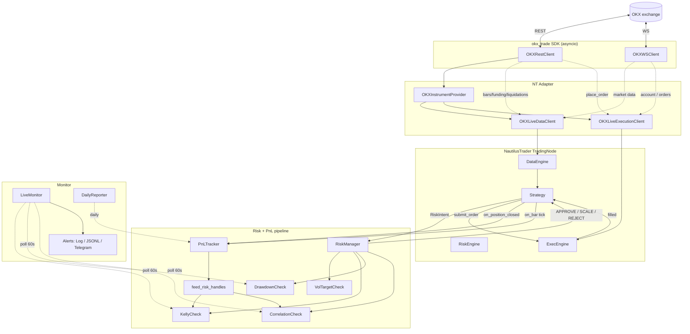

# Architecture

okx-trade 的运行时数据流、模块边界和关键设计决策。

## 高层数据流



## 模块职责（一行版）

| 模块 | 一句话 |
|---|---|
| `okx_trade.auth` | HMAC-SHA256 签名，纯函数 |
| `okx_trade.config` | `OKXSettings` 从 env 加载凭证 / 代理 |
| `okx_trade.exceptions` | 异常体系，`OKXAPIError` 透传 `data[0].sCode/sMsg` |
| `okx_trade.rest.transport` | `httpx` 重试 + 限频 + 业务码分类 |
| `okx_trade.rest.{trade,market,public,account}` | 各 REST endpoint 类型化封装 |
| `okx_trade.ws.client` | 三连接（public / private / business），订阅幂等，自动重连 |
| `okx_trade.adapter.parsing` | OKX raw → NT `Instrument` / `Bar` / `QuoteTick` 等 |
| `okx_trade.adapter.instrument_provider` | OKX 标的元数据缓存（min_quantity / lot_size 等） |
| `okx_trade.adapter.data` | NT `LiveDataClient`：订阅 / 反订阅 |
| `okx_trade.adapter.execution` | NT `LiveExecutionClient`：下单 / 撤单 / reconciliation |
| `okx_trade.adapter.factories` | 装配 NT TradingNode 用 |
| `okx_trade.strategies.base` | `BarBuffer` / `position_contracts` / strategy helpers |
| `okx_trade.strategies.{xs_momentum,funding_carry,liq_reversal,basis_arb,ob_imbalance,funding_cross_section,funding_skew_momentum,stat_arb_pairs,option_vol_selling,ml_fusion}` | 10 个策略本体（range_breakout 已 M5.X 下线） |
| `okx_trade.strategies._signals` | 跨策略共享纯函数（microprice / book_imbalance / annualized_basis 等） |
| `okx_trade.strategies._features` | ml_fusion 特征聚合（momentum / RV / funding_z / regime / btc_corr） |
| `okx_trade.pricing.options` | Black-Scholes pricer + Greeks（option_vol_selling 用） |
| `okx_trade.risk.stats` | rolling_beta / engle_granger_coint / ou_fit（funding_xs / stat_arb 用） |
| `okx_trade.backtest.walk_forward` | 滚动 train/test 切分 + 二分类评估（ml_fusion 训练用） |
| `okx_trade.strategies.confirmation` | OFI 反向时降仓 50%（共用 helper） |
| `okx_trade.strategies.pnl_hook` | 把 NT PositionEvent 转成 `PnLTracker.record_trade` |
| `okx_trade.risk.base` | `RiskCheck` / `RiskManager` / `RiskAction` / `RiskIntent` |
| `okx_trade.risk.vol_target` | N 日 realized vol → 目标仓位 |
| `okx_trade.risk.kelly` | f\* = (p×R - q)/R × 0.25 折扣 |
| `okx_trade.risk.drawdown` | 日 / 周 PnL 状态机 |
| `okx_trade.risk.correlation` | 滚动 N 日相关性矩阵 |
| `okx_trade.risk.integration` | yaml → `RiskManager` 工厂 + `apply_risk_manager` 调度 |
| `okx_trade.pnl.tracker` | SQLite 持久化 trades / equities |
| `okx_trade.pnl.stats` | 纯函数 stats: `compute_win_rate_avg_r` / `compute_daily_returns` / Sharpe |
| `okx_trade.pnl.feed` | tracker → risk handles 一站式回灌 |
| `okx_trade.portfolio.equal_weight` | 冷启动 4 策略均分 |
| `okx_trade.portfolio.risk_budget` | 30 日数据后切，inverse-vol + correlation penalty |
| `okx_trade.monitor.alerts` | `Alert` + sinks (Log / JSONL / Telegram / fan_out) |
| `okx_trade.monitor.live` | 60s 轮询风控状态 |
| `okx_trade.monitor.daily_report` | 每日 JSON 报表 |
| `okx_trade.runtime.live_node` | yaml + tracker + allocator → NT TradingNode + monitor task |
| `okx_trade.backtest.data_loader` | OKX 历史 bars → NT ParquetDataCatalog |
| `okx_trade.backtest.runner` | `BacktestNode` 配置 + 跑 + 汇总指标 |

## 关键设计决策

### 1. 策略代码 backtest / live 共享

NautilusTrader 抽象了 `DataClient` / `ExecutionClient`。回测时挂 `BacktestDataClient`，实盘挂我们的 `OKXLiveExecutionClient`。**Strategy 子类不区分模式**——这是 NT 选型的核心理由。

### 2. 风控不侵入 NT RiskEngine

NT 自带 `RiskEngine` 是订单层面的风控（balance / position limits），但策略层面的 Kelly / drawdown / correlation 不适合塞进去。我们的方案：**`RiskAwareStrategy` 在 `submit_order` 前手动调 `apply_risk_manager(intent)`**——避免依赖 NT 内部 API。

### 3. PnL → Kelly 反馈闭环

冷启动时 `RiskConfig.kelly_win_rate=0.55, kelly_avg_r=1.5`（f\*=0.25 → 6.25% 仓位）。
**前 20 笔成交后**，`feed_risk_handles` 把 tracker 算出的真实 win_rate / avg_R 调 `KellyCheck.set_stats()` 接管。低于阈值时不更新（避免坏数据污染）。

历史教训：早期 `kelly_win_rate=0.5, kelly_avg_r=1.0` 看似中性，但公式上 f\*=0 → 永远 REJECT 所有下单。Paper trading 跑了 10h 0 笔成交才发现。修复在 commit `e4eeb06` / `2c766ce`。

### 4. SDK 不依赖数值栈

`pip install okx_trade` 只装 `httpx + websockets + pydantic`。numpy / pandas / NautilusTrader 都在 `[strategy]` extras 里。SDK 用户（不做策略，只想调 OKX）依赖最小化。

### 5. 单一 OKX REST 客户端（async context manager）

`async with OKXRestClient(settings) as client` 在整个进程生命周期内复用一个 `httpx.AsyncClient`。连接池复用 + 限频共享。`OKXLiveExecutionClient` 持有这个 client 的所有权。

### 6. 错误透明传递

OKX 的"批量请求里至少一笔失败"错误模式：outer `code=1, msg="All operations failed"`，真因藏在 `data[0].sCode/sMsg`。`OKXAPIError.__str__` 自动提取并拼接，`OrderRejected.reason` 直接可读，无需翻 OKX 文档查 sCode 表。

## 配置文件层级

```
configs/
├── live.yaml                 # 主入口：策略列表 + risk_defaults + portfolio + monitor + alerts
├── risk.yaml                 # 参考样板（live.yaml 内联实际值）
└── strategies/
    ├── funding_carry.yaml     # 单策略参数（risk: 块覆盖 risk_defaults）
    ├── xs_momentum.yaml
    ├── liq_reversal.yaml
    ├── basis_arb.yaml         # M5：交割合约 vs 现货期现套利
    └── ob_imbalance.yaml      # M5：订单流 microprice 反转
```

加载顺序：`live.yaml.risk_defaults` 是基线 → 各 strategy yaml 的 `risk:` 块如果显式设值就覆盖。**dataclass `RiskConfig` 的硬编码默认是兜底**，但容易掉坑（比如 Kelly），尽量在 yaml 里显式。

## 部署拓扑

```
┌─────────────────────┐         ┌─────────────────────────────┐
│   开发机 (macOS)    │  git    │   Aliyun ECS (Ubuntu 22.04) │
│                     │ ──push─→│   /home/okxtrade/okx-trade  │
│ - 写代码            │         │   - systemd okx-trade       │
│ - 跑回测            │         │   - systemd healthcheck.timer│
│ - PR review         │         │   - cron: day_7 / day_14 报告│
└─────────────────────┘         └────────┬────────────────────┘
        │                                │
        │  ssh okx-vps                   │  REST + WS
        │  cat report                    ↓
        │                       ┌─────────────────────┐
        │                       │  OKX (demo / live)  │
        │                       └─────────────────────┘
        │
        ↓
   macOS Calendar 提醒（5/15、5/22）
```

## 测试策略

| 类型 | 数量 | 触发 | 何时跑 |
|---|---|---|---|
| Unit | 449 | `pytest tests/unit -v` | 每次 commit |
| Integration | (skip by default) | `pytest -m integration` | 手动，需 demo 凭证 |
| Backtest smoke | `scripts/backtest_m4_smoke.py` | 偶发 | 改完策略代码后 |
| Live observation | `scripts/observation_report.sh` | 7d / 14d cron | paper trading 期间 |

Unit test 大量使用 `respx` mock OKX REST + `pytest-asyncio` 跑异步代码。`risk` / `pnl` / `portfolio` 模块都是纯计算，单测 100% 覆盖。
