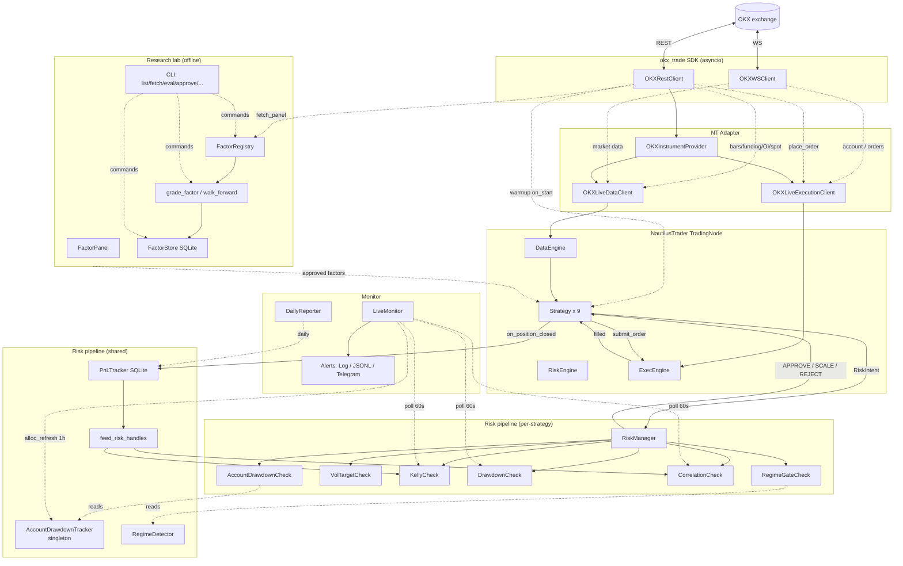

# Architecture

okx-trade 的运行时数据流、模块边界和关键设计决策。

## 高层数据流



## 模块职责（一行版）

| 模块 | 一句话 |
|---|---|
| `okx_trade.auth` | HMAC-SHA256 签名，纯函数 |
| `okx_trade.config` | `OKXSettings` 从 env 加载凭证 / 代理 |
| `okx_trade.exceptions` | 异常体系，`OKXAPIError` 透传 `data[0].sCode/sMsg` |
| `okx_trade.rest.transport` | `httpx` 重试 + 限频 + 业务码分类 |
| `okx_trade.rest.{trade,market,public,account}` | 各 REST endpoint 类型化封装 |
| `okx_trade.ws.client` | 三连接（public / private / business），订阅幂等，自动重连 |
| `okx_trade.adapter.parsing` | OKX raw → NT `Instrument` / `Bar` / `QuoteTick` 等 |
| `okx_trade.adapter.instrument_provider` | OKX 标的元数据缓存（min_quantity / lot_size 等） |
| `okx_trade.adapter.data` | NT `LiveDataClient`：订阅 / 反订阅 |
| `okx_trade.adapter.execution` | NT `LiveExecutionClient`：下单 / 撤单 / reconciliation |
| `okx_trade.adapter.factories` | 装配 NT TradingNode 用 |
| `okx_trade.strategies.base` | `BarBuffer` / `position_contracts` / strategy helpers |
| `okx_trade.strategies.{xs_momentum,funding_carry,liq_reversal,basis_arb,ob_imbalance,funding_cross_section,funding_skew_momentum,stat_arb_pairs,option_vol_selling,ml_fusion}` | 10 个策略本体（range_breakout 已 M5.X 下线） |
| `okx_trade.strategies._signals` | 跨策略共享纯函数（microprice / book_imbalance / annualized_basis 等） |
| `okx_trade.strategies._features` | ml_fusion 特征聚合（momentum / RV / funding_z / regime / btc_corr） |
| `okx_trade.pricing.options` | Black-Scholes pricer + Greeks（option_vol_selling 用） |
| `okx_trade.risk.stats` | rolling_beta / engle_granger_coint / ou_fit（funding_xs / stat_arb 用） |
| `okx_trade.backtest.walk_forward` | 滚动 train/test 切分 + 二分类评估（ml_fusion 训练用） |
| `okx_trade.strategies.confirmation` | OFI 反向时降仓 50%（共用 helper） |
| `okx_trade.strategies.pnl_hook` | 把 NT PositionEvent 转成 `PnLTracker.record_trade` |
| `okx_trade.risk.base` | `RiskCheck` / `RiskManager` / `RiskAction` / `RiskIntent` |
| `okx_trade.risk.vol_target` | N 日 realized vol → 目标仓位 |
| `okx_trade.risk.kelly` | f\* = (p×R - q)/R × 0.25 折扣 |
| `okx_trade.risk.drawdown` | 日 / 周 PnL 状态机 + `AccountDrawdownTracker` / `AccountDrawdownCheck` (Phase 0 单源 kill-switch) |
| `okx_trade.risk.correlation` | 滚动 N 日相关性矩阵 |
| `okx_trade.risk.regime` | BTC trending / mean_reverting / neutral 判定（规则 / HMM）+ `RegimeGateCheck` |
| `okx_trade.risk.stats` | rolling_beta / engle_granger_coint / OU 估计（funding_xs / stat_arb 用） |
| `okx_trade.risk.integration` | yaml → `RiskManager` 工厂 + `apply_risk_manager` 调度（接 `account_drawdown_tracker` 注入） |
| `okx_trade.research.panel` | `FactorPanel` 多 inst 多 ts 特征容器 |
| `okx_trade.research.registry` | `@register_factor` 装饰器 + 全局注册表 |
| `okx_trade.research.compute` | 单因子求值 + shape 校验 |
| `okx_trade.research.data` | `fetch_panel` + parquet cache（close / volume / funding / OI / basis_apr） |
| `okx_trade.research.grade` | 单因子 grade：IC / IR / decay / turnover / net-PnL + 通过门槛判定 |
| `okx_trade.research.walk_forward_grade` | OOS 滚窗 grade（rolling 6m train / 1m test 同样可用） |
| `okx_trade.research.store` | `FactorStore` sqlite：factor metadata + grade 历史 |
| `okx_trade.research.report` | grade 结果 → markdown 报告 |
| `okx_trade.research.cli` | `python -m okx_trade.research <list|fetch|eval|grade-all|approve|reject|backtest-portfolio|report|wf-grade|corr-matrix>` |
| `okx_trade.research.factors.*` | 15 个 v1 因子：momentum × 4 / funding_oi × 4 / basis × 2 / volatility × 3 / flow × 2 |
| `okx_trade.pnl.tracker` | SQLite 持久化 trades / equities |
| `okx_trade.pnl.stats` | 纯函数 stats: `compute_win_rate_avg_r` / `compute_daily_returns` / Sharpe |
| `okx_trade.pnl.feed` | tracker → risk handles 一站式回灌 |
| `okx_trade.portfolio.equal_weight` | 冷启动 4 策略均分 |
| `okx_trade.portfolio.risk_budget` | 30 日数据后切，inverse-vol + correlation penalty |
| `okx_trade.monitor.alerts` | `Alert` + sinks (Log / JSONL / Telegram / fan_out) |
| `okx_trade.monitor.live` | 60s 轮询风控状态 |
| `okx_trade.monitor.daily_report` | 每日 JSON 报表 |
| `okx_trade.runtime.live_node` | yaml + tracker + allocator → NT TradingNode + monitor task |
| `okx_trade.backtest.data_loader` | OKX 历史 bars → NT ParquetDataCatalog |
| `okx_trade.backtest.runner` | `BacktestNode` 配置 + 跑 + 汇总指标 |

## 关键设计决策

### 1. 策略代码 backtest / live 共享

NautilusTrader 抽象了 `DataClient` / `ExecutionClient`。回测时挂 `BacktestDataClient`，实盘挂我们的 `OKXLiveExecutionClient`。**Strategy 子类不区分模式**——这是 NT 选型的核心理由。

### 2. 风控不侵入 NT RiskEngine

NT 自带 `RiskEngine` 是订单层面的风控（balance / position limits），但策略层面的 Kelly / drawdown / correlation 不适合塞进去。我们的方案：**`RiskAwareStrategy` 在 `submit_order` 前手动调 `apply_risk_manager(intent)`**——避免依赖 NT 内部 API。

### 3. PnL → Kelly 反馈闭环

冷启动时 `RiskConfig.kelly_win_rate=0.55, kelly_avg_r=1.5`（f\*=0.25 → 6.25% 仓位）。
**前 20 笔成交后**，`feed_risk_handles` 把 tracker 算出的真实 win_rate / avg_R 调 `KellyCheck.set_stats()` 接管。低于阈值时不更新（避免坏数据污染）。

历史教训：早期 `kelly_win_rate=0.5, kelly_avg_r=1.0` 看似中性，但公式上 f\*=0 → 永远 REJECT 所有下单。Paper trading 跑了 10h 0 笔成交才发现。修复在 commit `e4eeb06` / `2c766ce`。

### 4. SDK 不依赖数值栈

`pip install okx_trade` 只装 `httpx + websockets + pydantic`。numpy / pandas / NautilusTrader 都在 `[strategy]` extras 里。SDK 用户（不做策略，只想调 OKX）依赖最小化。

### 5. 单一 OKX REST 客户端（async context manager）

`async with OKXRestClient(settings) as client` 在整个进程生命周期内复用一个 `httpx.AsyncClient`。连接池复用 + 限频共享。`OKXLiveExecutionClient` 持有这个 client 的所有权。

### 6. 错误透明传递

OKX 的"批量请求里至少一笔失败"错误模式：outer `code=1, msg="All operations failed"`，真因藏在 `data[0].sCode/sMsg`。`OKXAPIError.__str__` 自动提取并拼接，`OrderRejected.reason` 直接可读，无需翻 OKX 文档查 sCode 表。

### 7. 账户级 DD 单源 kill-switch（Phase 0, 2026-05-20）

事故催生：5/12 monitor 把 OKX `totalEq` 推到 N 个 per-strategy `DrawdownTracker` 当作"权益"；5/20 发现 (a) `equity_provider` 读的是 `USDT.avail_eq`（开仓冻保证金时下跌），(b) 各 strategy 又自己读 NT cached USDT balance 喂同一个 tracker，两源差 27% 直接打穿周熝断。

修后架构：
- **`AccountDrawdownTracker` 单例**：`LiveMonitor` 持有，每次 alloc_refresh 喂 OKX `totalEq`（整账户净值，含所有币种 + UPL）
- **`AccountDrawdownCheck`**：通过 `build_risk_manager(... account_drawdown_tracker=...)` 注入到每个策略的 risk pipeline **前置**
- Per-strategy `DrawdownTracker` 保留，但目前不喂数据（Phase 1 接 PnLTracker 的 per-strategy realized PnL 做真隔离）

任一策略命中 account-level check 即全员 kill-switch；单源单告警；杜绝 5/12 的多源污染问题。

### 8. 策略冷启动消除：REST warmup

NT 重启后多个策略需要数天-数十天的 live 数据累计才能产出第一个交易决策（如 `stat_arb_pairs` 需 60 天 1H bar 算协整、`funding_cross_section` 需 30 天 1D close 算 β、`factor_portfolio` 的 `basis_z_30d` / `funding_z_30d` 需 30 天 rolling z-score）。

通用模式：策略 `on_start` 用 `loop.create_task(...)` spawn 一个异步 REST fetch，几秒钟内拉回完整 lookback 窗口的历史数据填进 buffer。配置项 `warmup_via_rest: bool` 或 `warmup_via_rest_days: int`；backtest 模式设为 0/False 关闭（用模拟时钟）。

`factor_portfolio` 复用 `research.data.fetch_panel`，把 fetched `FactorPanel` 喂给 `_apply_warmup_panel`（与 `--warmup-days` CLI 用的是同一个 loader）。

### 9. 因子研究 lab：CLI-driven offline pipeline

`okx_trade.research` 是离线模块：CLI 拉 OKX 历史数据 → 灌进 `FactorPanel` → 跑 `@register_factor` 装饰的函数 → grade（IC/IR/decay/turnover/net-PnL）→ 通过门槛的因子写入 `configs/factor_portfolio.yaml` 直接被 `FactorPortfolioStrategy` 消费。

这把"加一个新因子"的工作量从"写一个新策略类 + yaml + 接入 live_node"压缩到"加一个 `@register_factor` 装饰的函数 + CLI approve"。已落 15 个 v1 因子（momentum / funding-OI / basis / volatility / flow 5 类）。

### 10. Isolated margin per leg + two-phase set-leverage（FundingXS, 2026-05-26）

事故催生：5/25 OKX demo 撮合在 DOT-USDT-SWAP 一根 1m K 内 $1.45 → $121.985 插针，`FundingXSStrategy` 一笔 738 contract short 被强平 -$51,128。根因不是 sizing 失控（单腿 notional 只占账户 1%），是 **cross-margin 让单腿浮亏吃掉整账户**。

修后架构（**仅 FundingXS**，公共抽象在 Phase-1 follow-up）：

- **OKX `set-leverage` per leg**：策略侧维护 `_set_lever_cache: dict[(inst, posSide), lever]`，每次 rebalance 算出 dynamic leverage 后只在 (inst, posSide, lever) 变化时调 REST。Idempotent。
- **`tdMode=isolated` via OrderTags**：策略下单时附 `tags=["td_mode:isolated"]`，OKX adapter 现有 tag-override 路径透传给 OKX REST。无需改 trader-level `pos_side_mode` 或 OmsType。
- **Dynamic leverage from edge_score**：`compute_edge_score(funding_z, basis_z, direction, combine_basis)` → `compute_leverage(edge_score, base, slope, lo, hi)`。conviction 越高 leverage 越高 → isolated margin 越小 → 损失上限越低。
- **Outlier guard at entry**：1m bar 独立订阅到 `_closes_1m_by_inst`，`outlier_check` 计算近 1h vol vs 24h baseline ratio，超阈值跳腿。
- **`_execute_diff` 两阶段提交**：Phase 1 close 旧腿（无 set-leverage 依赖）；Phase 2 收集要开的腿；Phase 3 pre-validate `set_leverage` for all to-open，任一失败整轮 abort（log `ABORT rebalance` + 0 单 directional residual）；Phase 4 才真正 `submit_order`。
- **posMode 自检**：strategy 启动时 query `/api/v5/account/config` 缓存 OKX 账户的 `posMode`（`net_mode` / `long_short_mode`）；set-leverage 时按 leg direction 传 `PosSide.LONG` / `PosSide.SHORT`，long_short 账户需要这个，net 账户由 `account.py` 自动补 `PosSide.NET`。

设计目标：单腿最坏损失从"整账户"降到"isolated margin = notional / lever"，即 0.5-5% 账户。完整 spec + plan：

- `docs/superpowers/specs/2026-05-26-funding-xs-isolated-margin-design.md`（含 §9a addendum 记录 long_short_mode 发现）
- `docs/superpowers/plans/2026-05-26-funding-xs-isolated-margin.md`（17 个 TDD task）
- Rollback runbook：`docs/operations.md` §五·B

### 10.1 Phase 1：抽成共享 service（2026-05-26 当日 later）

§10 的 FundingXS-specific 实现进了三个共享件，让其他 9 个策略也能 opt-in：

- **`IsolatedMarginService`**（`src/okx_trade/risk/isolated_margin_service.py`）—— 单例：posMode cache + (inst, posSide)→lever cache + 共享 OKXRestClient。`ensure_leverage`（idempotent）+ `batch_ensure_leverage`（多腿两阶段 commit）+ `is_backtest()`。10 个策略复用同一份 cache：FundingXS 设了 DOT/long=5×，后续 XSMomentum 想同样会直接命中 cache 不再调 REST。
- **`VolatilityFilter`**（`src/okx_trade/risk/volatility_filter.py`）—— 单例：per-inst 1m close deques + `allow(inst_id)`。策略订阅 1m bar 后 `feed_bar()` 投喂；NT DataEngine 自动 dedup 多策略的相同订阅。
- **`OkxStrategyBase`**（`src/okx_trade/strategies/_okx_base.py`）—— 可选 thin base 继承 NT `Strategy`，提供 `submit_isolated_order(order, lever, pos_side)` 一句调（处理 7 个分支：disabled/no-service/backtest/net-mode/long_short-derive/lever-fail/happy）+ `vol_filter_allow` 便捷包。

DI 在 `runtime/live_node.py` `build_live_context` 里构造服务 + 注入到每个 `OkxStrategyBase` 子类（同 `account_drawdown_tracker` 路径）。`live.yaml` 加 top-level `volatility_filter:` block。

FundingXS 已迁完（Phase 1b）：原 `_set_lever_cache` / `_get_account_pos_mode` / `_set_leverage_cached` / `_closes_1m_by_inst` / `_is_backtest_context` 全删，换成 service 调用，行为等价。

**Phase 1c 完整 rollout（同日 later）**：6 个其他活跃策略全部接入 `OkxStrategyBase`，yaml `enable_isolated_margin: true` 翻起 → funding_carry (lever=5) / funding_skew_momentum (lever=5) / xs_momentum (lever=3) / stat_arb_pairs (lever=3, batch_ensure_leverage 两阶段) / basis_arb (lever=3, futures-leg only) / factor_portfolio (lever=3)。`liq_reversal` / `ob_imbalance` 明确不接入（wick 是 alpha / 微秒级延迟），`range_breakout` 已 retired，`ml_fusion` xgboost 未装。第一次 position-open 时各策略 lazily 调 `set-leverage`。

### 11. OKX positions reconcile 按 inst_id 推 instType（2026-05-26）

`adapter/execution.py:generate_position_status_reports` 原来不管 inst_id 是什么都用 `instType=SWAP` 查 `/account/positions`。NT reconcile 时按每个 inst 调一次，basis_arb 的 SPOT 腿或 FUTURES 腿走这条路就被 OKX 拒 `51015 Instrument ID doesn't match instrument type`，NT 拿不到真实持仓 → in-memory state 与 venue 分叉 → 其他策略发 reduce-only 单遭 `51169` 拒。

修后用 `_infer_positions_inst_type(inst_id)` 按字符串格式分类（`*-SWAP` / `*-YYMMDD` / `*-YYMMDD-K-C/P`）传对应 instType；SPOT 直接跳过 query（positions 端点本就不返 SPOT，SPOT 资产走 `/account/balance`）。每次重启从 4-5 个 `positions_failed` warning 变 0，下游 `51169` cascade 也随之消失。

## 配置文件层级

```
configs/
├── live.yaml                  # 主入口：策略列表 + risk_defaults + portfolio + monitor + alerts
├── risk.yaml                  # 参考样板（live.yaml 内联实际值）
├── factor_portfolio.yaml      # FactorPortfolioStrategy：approved 因子 + 权重 + universe
└── strategies/
    ├── funding_carry.yaml      # 单策略参数（risk: 块覆盖 risk_defaults）
    ├── xs_momentum.yaml
    ├── liq_reversal.yaml
    ├── basis_arb.yaml          # M5：交割合约 vs 现货期现套利
    ├── ob_imbalance.yaml       # M5：订单流 microprice 反转
    ├── funding_cross_section.yaml   # M6+：多空 funding + β-hedge
    ├── funding_skew_momentum.yaml   # M6+：funding ±2σ 反向
    ├── stat_arb_pairs.yaml          # M6+：BTC-ETH 协整套利
    ├── option_vol_selling.yaml      # M6+：BTC short straddle（暂 disabled）
    └── ml_fusion.yaml               # M6+：XGBoost meta（暂 disabled）
```

加载顺序：`live.yaml.risk_defaults` 是基线 → 各 strategy yaml 的 `risk:` 块如果显式设值就覆盖。**dataclass `RiskConfig` 的硬编码默认是兜底**，但容易掉坑（比如 Kelly），尽量在 yaml 里显式。

`AccountDrawdownTracker` 阈值从 `live.yaml.risk_defaults.drawdown_daily_pct / drawdown_weekly_pct` 读取（与 per-strategy DD 同源），由 `build_live_context` 构造单例后注入 `LiveMonitor` 和每个策略的 `build_risk_manager(...)`。

## 部署拓扑

```
┌─────────────────────┐         ┌─────────────────────────────┐
│   开发机 (macOS)    │  git    │   Aliyun ECS (Ubuntu 22.04) │
│                     │ ──push─→│   /home/okxtrade/okx-trade  │
│ - 写代码            │         │   - systemd okx-trade       │
│ - 跑回测            │         │   - systemd healthcheck.timer│
│ - PR review         │         │   - cron: day_7 / day_14 报告│
└─────────────────────┘         └────────┬────────────────────┘
        │                                │
        │  ssh okx-vps                   │  REST + WS
        │  cat report                    ↓
        │                       ┌─────────────────────┐
        │                       │  OKX (demo / live)  │
        │                       └─────────────────────┘
        │
        ↓
   macOS Calendar 提醒（5/15、5/22）
```

## 测试策略

| 类型 | 数量 | 触发 | 何时跑 |
|---|---|---|---|
| Unit | 803 | `pytest tests/unit -v` | 每次 commit |
| Integration | (skip by default) | `pytest -m integration` | 手动，需 demo 凭证 |
| Backtest smoke | `scripts/backtest_m4_smoke.py` | 偶发 | 改完策略代码后 |
| Factor lab smoke | `scripts/factor_research_smoke.sh` | 偶发 | 改 research/ 后 |
| Live observation | `scripts/observation_report.sh` | 7d / 14d cron | paper trading 期间 |
| stat_arb observation | `scripts/stat_arb_observe.sh` | 24h / lunch cron | stat_arb 启用后 |

Unit test 大量使用 `respx` mock OKX REST + `pytest-asyncio` 跑异步代码。`risk` / `pnl` / `portfolio` / `research` 模块都是纯计算，单测 100% 覆盖。

诊断工具（运行时排障）：
- `scripts/diag_account_bills.py` — OKX 流水按 type/subType 汇总（funding fee / trade fee / settle PnL），定位"账户突然下跌但不知道哪笔成交"
- `scripts/diag_mtm_swing.py` — 当前持仓 + 1H candles 变化对照，分离 realized vs unrealized PnL
- 运维手册：[docs/operations.md](docs/operations.md)
